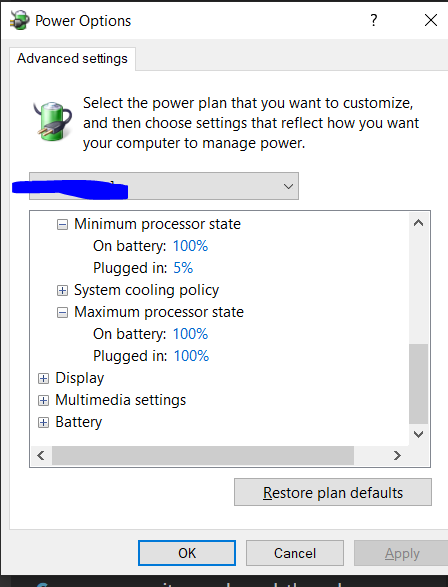

# hpc_cpp
benchmarking in cpp


## building google benchmark lib

```
# Check out the library.
$ git clone https://github.com/google/benchmark.git
# Benchmark requires Google Test as a dependency. Add the source tree as a subdirectory.
$ git clone https://github.com/google/googletest.git benchmark/googletest

Install VS 2019
Open the benchmark folder.
Right click on "CMakeLists.txt", select "Build" and "Run Tests"
```

## Running benchmark
In Developer command prompt for X64, interactive developer command prompt:

```
> type nul >> hpc_cpp.cpp
> msbuild -p:Configuration=Release
> x64\Release\hpc_cpp.exe --benchmark_filter=.*Add.*
```

## About real time from google benchmark docs
```
// Measure the user-visible time, the wall clock (literally, the time that
// has passed on the clock on the wall), use it to decide for how long to
// run the benchmark loop. This will always be meaningful, an will match the
// time spent by the main thread in single-threaded case, in general decreasing
// with the number of internal threads doing the work.
```

```
04/05/20 22:12:26
Running x64\Release\hpc_cpp.exe
Run on (8 X 2808 MHz CPU s)
CPU Caches:
  L1 Data 32 KiB (x4)
  L1 Instruction 32 KiB (x4)
  L2 Unified 256 KiB (x4)
  L3 Unified 6144 KiB (x1)

> Without DoNotOptimize

-------------------------------------------------------
Benchmark             Time             CPU   Iterations
-------------------------------------------------------
BM_Add            0.300 ns        0.297 ns   1000000000
BM_MutexAdd        23.6 ns         23.5 ns     29866667
BM_AtomicAdd       5.65 ns         5.75 ns     89600000
-------------------------------------------------------

> With DoNotOptimize

Benchmark             Time             CPU   Iterations
-------------------------------------------------------
BM_Add             1.27 ns         1.22 ns    497777778
BM_MutexAdd        23.8 ns         24.0 ns     34461538
BM_AtomicAdd       8.18 ns         8.16 ns     74666667

D:\gitrepos\hpc_benchmark\hpc_cpp\hpc_cpp>x64\Release\hpc_cpp.exe
04/06/20 00:34:29
Running x64\Release\hpc_cpp.exe
Run on (8 X 2808 MHz CPU s)
CPU Caches:
  L1 Data 32 KiB (x4)
  L1 Instruction 32 KiB (x4)
  L2 Unified 256 KiB (x4)
  L3 Unified 6144 KiB (x1)
---------------------------------------------------------------------------------------------
Benchmark                                                   Time             CPU   Iterations
---------------------------------------------------------------------------------------------
BM_noLockAdd                                             1.64 ns         1.64 ns    448000000
BM_MultiThreadedMutexAdd/real_time/threads:1             23.6 ns         24.0 ns     27389563
BM_MultiThreadedMutexAdd/real_time/threads:2             34.3 ns         67.7 ns     15225302
BM_MultiThreadedMutexAdd/real_time/threads:4             36.8 ns          146 ns     17160792
BM_MultiThreadedMutexAdd/real_time/threads:8             41.3 ns          325 ns     16747440
BM_MultiThreadedMutexAdd/real_time/threads:12            40.2 ns          328 ns     18110520
BM_MultiThreadedMutexAdd/real_time/threads:16            39.8 ns          326 ns     16000000
BM_MultiThreadedMutexAdd/real_time/threads:32            37.5 ns          324 ns     21492640
BM_MultiThreadedMutexBaseline/real_time/threads:1        48.7 ns         49.4 ns     12974376
BM_MultiThreadedMutexBaseline/real_time/threads:2        30.0 ns         59.5 ns     20470380
BM_MultiThreadedMutexBaseline/real_time/threads:4        33.8 ns          130 ns     19163332
BM_MultiThreadedMutexBaseline/real_time/threads:8        39.4 ns          308 ns     17966552
BM_MultiThreadedMutexBaseline/real_time/threads:12       36.6 ns          304 ns     18119268
BM_MultiThreadedMutexBaseline/real_time/threads:16       38.1 ns          308 ns     20118864
BM_MultiThreadedMutexBaseline/real_time/threads:32       36.5 ns          309 ns     42667744
BM_MultiThreadedAtomicAdd/real_time/threads:1            7.76 ns         7.87 ns     91371049
BM_MultiThreadedAtomicAdd/real_time/threads:2            14.3 ns         28.8 ns     47166488
BM_MultiThreadedAtomicAdd/real_time/threads:4            20.1 ns         79.8 ns     35235528
BM_MultiThreadedAtomicAdd/real_time/threads:8            21.4 ns          166 ns     33263624
BM_MultiThreadedAtomicAdd/real_time/threads:12           21.0 ns          175 ns     34309692
BM_MultiThreadedAtomicAdd/real_time/threads:16           21.0 ns          175 ns     36787696
BM_MultiThreadedAtomicAdd/real_time/threads:32           19.6 ns          172 ns     32000000
BM_FalseSharingMutexAddBefore/real_time/threads:1        25.4 ns         25.3 ns     28371140
BM_FalseSharingMutexAddBefore/real_time/threads:2        29.8 ns         60.0 ns     24752782
BM_FalseSharingMutexAddBefore/real_time/threads:4        33.5 ns          134 ns     20400328
BM_FalseSharingMutexAddBefore/real_time/threads:8        37.5 ns          293 ns     18610168
BM_FalseSharingMutexAddBefore/real_time/threads:12       39.7 ns          323 ns     19371936
BM_FalseSharingMutexAddAfter/real_time/threads:1         24.4 ns         24.1 ns     29128084
BM_FalseSharingMutexAddAfter/real_time/threads:2         26.9 ns         53.9 ns     25789266
BM_FalseSharingMutexAddAfter/real_time/threads:4         33.3 ns          131 ns     21199444
BM_FalseSharingMutexAddAfter/real_time/threads:8         37.5 ns          288 ns     18301656
BM_FalseSharingMutexAddAfter/real_time/threads:12        38.9 ns          320 ns     19180848
BM_FalseSharingMutexAddFar/real_time/threads:1           49.9 ns         50.2 ns     28607953
BM_FalseSharingMutexAddFar/real_time/threads:2           26.2 ns         51.2 ns     25029526
BM_FalseSharingMutexAddFar/real_time/threads:4           34.8 ns          138 ns     21451872
BM_FalseSharingMutexAddFar/real_time/threads:8           40.1 ns          319 ns     17197144
BM_FalseSharingMutexAddFar/real_time/threads:12          39.3 ns          318 ns     18298692

> x64\Release\hpc_cpp.exe --benchmark_filter=.*Seq.*
04/06/20 02:08:00
Running x64\Release\hpc_cpp.exe
Run on (8 X 2808 MHz CPU s)
CPU Caches:
  L1 Data 32 KiB (x4)
  L1 Instruction 32 KiB (x4)
  L2 Unified 256 KiB (x4)
  L3 Unified 6144 KiB (x1)
------------------------------------------------------------------------------
Benchmark                                    Time             CPU   Iterations
------------------------------------------------------------------------------
BM_WriteSeq<char>/1024/real_time           469 ns          444 ns      1968569
BM_WriteSeq<char>/4096/real_time          1303 ns         1265 ns       444740
BM_WriteSeq<char>/16384/real_time         6312 ns         6406 ns       100000
BM_WriteSeq<char>/65536/real_time        22889 ns        22508 ns        32628
BM_WriteSeq<char>/262144/real_time       95785 ns        94791 ns         8077
BM_WriteSeq<char>/1048576/real_time     395683 ns       388817 ns         1728
BM_WriteSeq<char>/2097152/real_time     729731 ns       742403 ns          905
BM_WriteSeq<int>/1024/real_time           97.8 ns         96.5 ns      5345413
BM_WriteSeq<int>/4096/real_time            358 ns          349 ns      1609632
BM_WriteSeq<int>/16384/real_time          1478 ns         1454 ns       537366
BM_WriteSeq<int>/65536/real_time          5834 ns         5767 ns       116512
BM_WriteSeq<int>/262144/real_time        25518 ns        24599 ns        27313
BM_WriteSeq<int>/1048576/real_time      120424 ns       116811 ns         7357
BM_WriteSeq<int>/2097152/real_time      236387 ns       229848 ns         3331
BM_WriteSeq<long>/1024/real_time          86.2 ns         87.1 ns      8427957
BM_WriteSeq<long>/4096/real_time           396 ns          378 ns      1281033
BM_WriteSeq<long>/16384/real_time         2238 ns         2116 ns       302761
BM_WriteSeq<long>/65536/real_time         5724 ns         5687 ns       112638
BM_WriteSeq<long>/262144/real_time       25932 ns        26068 ns        32367
BM_WriteSeq<long>/1048576/real_time     108362 ns       108869 ns         6889
BM_WriteSeq<long>/2097152/real_time     205740 ns       199893 ns         3752
BM_ReadSeq<char>/1024/real_time            157 ns          160 ns      3620763
BM_ReadSeq<char>/4096/real_time            730 ns          708 ns      1102706
BM_ReadSeq<char>/16384/real_time          3528 ns         3505 ns       213963
BM_ReadSeq<char>/65536/real_time         11319 ns        11428 ns        54688
BM_ReadSeq<char>/262144/real_time        48356 ns        48551 ns        14804
BM_ReadSeq<char>/1048576/real_time      256221 ns       248690 ns         2576
BM_ReadSeq<char>/2097152/real_time      417890 ns       416898 ns         1799
BM_ReadSeq<int>/1024/real_time            61.2 ns         60.8 ns     14137618
BM_ReadSeq<int>/4096/real_time             214 ns          214 ns      4593750
BM_ReadSeq<int>/16384/real_time            653 ns          647 ns      1062280
BM_ReadSeq<int>/65536/real_time           3051 ns         2985 ns       256508
BM_ReadSeq<int>/262144/real_time         14571 ns        14122 ns        61962
BM_ReadSeq<int>/1048576/real_time        57072 ns        54654 ns        10292
BM_ReadSeq<int>/2097152/real_time       106126 ns       104612 ns         7020
BM_ReadSeq<long>/1024/real_time           52.9 ns         50.2 ns     11214516
BM_ReadSeq<long>/4096/real_time            198 ns          199 ns      4007238
BM_ReadSeq<long>/16384/real_time           790 ns          765 ns      1041509
BM_ReadSeq<long>/65536/real_time          2957 ns         2955 ns       253802
BM_ReadSeq<long>/262144/real_time        12674 ns        12691 ns        60329
BM_ReadSeq<long>/1048576/real_time       62379 ns        60212 ns         8823
BM_ReadSeq<long>/2097152/real_time      103878 ns       104949 ns         5062

> x64\Release\hpc_cpp.exe --benchmark_filter=.*Write.*long.*
04/07/20 02:03:41
Running x64\Release\hpc_cpp.exe
Run on (8 X 2808 MHz CPU s)
CPU Caches:
  L1 Data 32 KiB (x4)
  L1 Instruction 32 KiB (x4)
  L2 Unified 256 KiB (x4)
  L3 Unified 6144 KiB (x1)

-----------------------------------------------------------------------------------
Benchmark                                         Time             CPU   Iterations
-----------------------------------------------------------------------------------
BM_WriteSeq<long>/1024/real_time               80.5 ns         75.7 ns      6807736
BM_WriteSeq<long>/2048/real_time                155 ns          152 ns      3801941
BM_WriteSeq<long>/4096/real_time                302 ns          299 ns      2142263
BM_WriteSeq<long>/8192/real_time                578 ns          580 ns      1078232
BM_WriteSeq<long>/16384/real_time              1217 ns         1204 ns       596882
BM_WriteSeq<long>/32768/real_time              2395 ns         2362 ns       284479
BM_WriteSeq<long>/65536/real_time              5084 ns         5186 ns       135575
BM_WriteSeq<long>/131072/real_time            10018 ns        10021 ns        68608
BM_WriteSeq<long>/262144/real_time            21123 ns        21841 ns        32909
BM_WriteSeq<long>/524288/real_time            44714 ns        45165 ns        15914
BM_WriteSeq<long>/1048576/real_time           89513 ns        90295 ns         7787
BM_WriteSeq<long>/2097152/real_time          179313 ns       178434 ns         3240
BM_WriteSeq<long>/4194304/real_time          384678 ns       379415 ns         1812
BM_WriteSeq<long>/8388608/real_time          773888 ns       776007 ns          745
BM_WriteRand<long>/1024/real_time              83.7 ns         82.5 ns      8522098
BM_WriteRand<long>/2048/real_time               171 ns          171 ns      4214316
BM_WriteRand<long>/4096/real_time               334 ns          334 ns      2010351
BM_WriteRand<long>/8192/real_time               681 ns          674 ns      1043684
BM_WriteRand<long>/16384/real_time             1341 ns         1374 ns       488911
BM_WriteRand<long>/32768/real_time             5596 ns         5497 ns       122229
BM_WriteRand<long>/65536/real_time            17415 ns        17341 ns        35141
BM_WriteRand<long>/131072/real_time           38455 ns        38305 ns        17948
BM_WriteRand<long>/262144/real_time           94041 ns        95158 ns         5747
BM_WriteRand<long>/524288/real_time          260762 ns       264069 ns         2781
BM_WriteRand<long>/1048576/real_time         544935 ns       529063 ns         1329
BM_WriteRand<long>/2097152/real_time        1141083 ns      1133675 ns          634
BM_WriteRand<long>/4194304/real_time        2515579 ns      2513112 ns          286
BM_WriteRand<long>/8388608/real_time       10066549 ns      9982639 ns           72
BM_WriteSeqIndex<long>/1024/real_time          86.0 ns         85.2 ns      8437954
BM_WriteSeqIndex<long>/2048/real_time           168 ns          168 ns      3339633
BM_WriteSeqIndex<long>/4096/real_time           336 ns          349 ns      2058408
BM_WriteSeqIndex<long>/8192/real_time           670 ns          655 ns      1049404
BM_WriteSeqIndex<long>/16384/real_time         1368 ns         1344 ns       511510
BM_WriteSeqIndex<long>/32768/real_time         2980 ns         2958 ns       237714
BM_WriteSeqIndex<long>/65536/real_time         5909 ns         5775 ns       116342
BM_WriteSeqIndex<long>/131072/real_time       11932 ns        11654 ns        45584
BM_WriteSeqIndex<long>/262144/real_time       24829 ns        24783 ns        24588
BM_WriteSeqIndex<long>/524288/real_time       49433 ns        48878 ns        13746
BM_WriteSeqIndex<long>/1048576/real_time     101914 ns       102258 ns         5348
BM_WriteSeqIndex<long>/2097152/real_time     207123 ns       208025 ns         3380
BM_WriteSeqIndex<long>/4194304/real_time     487370 ns       457418 ns         1503
BM_WriteSeqIndex<long>/8388608/real_time    1240509 ns      1243219 ns          553

-----------------------------------------------------------------------------------------
Benchmark                                               Time             CPU   Iterations
-----------------------------------------------------------------------------------------
BM_FalseSharing2Global/0/real_time/threads:1         8045 ns         8252 ns        77628
BM_FalseSharing2Global/0/real_time/threads:2        21589 ns        42323 ns        36180
BM_FalseSharing2Global/0/real_time/threads:4        22140 ns        85201 ns        32460
BM_FalseSharing2Global/0/real_time/threads:8        22177 ns       168493 ns        31344
BM_FalseSharing2Global/0/real_time/threads:12       20661 ns       172138 ns        33948
BM_FalseSharing2Global/4/real_time/threads:1         7706 ns         7625 ns        92211
BM_FalseSharing2Global/4/real_time/threads:2        20841 ns        41101 ns        52462
BM_FalseSharing2Global/4/real_time/threads:4        21932 ns        87557 ns        31408
BM_FalseSharing2Global/4/real_time/threads:8         9797 ns        71734 ns        71880
BM_FalseSharing2Global/4/real_time/threads:12        9327 ns        78036 ns        77088
BM_FalseSharing2Global/8/real_time/threads:1         8328 ns         8362 ns        71002
BM_FalseSharing2Global/8/real_time/threads:2        19970 ns        37417 ns        34660
BM_FalseSharing2Global/8/real_time/threads:4         6139 ns        24081 ns       138856
BM_FalseSharing2Global/8/real_time/threads:8         6477 ns        48438 ns        80000
BM_FalseSharing2Global/8/real_time/threads:12        5296 ns        42336 ns       155748
BM_FalseSharing2Global/16/real_time/threads:1        8343 ns         8140 ns        92139
BM_FalseSharing2Global/16/real_time/threads:2        4093 ns         8303 ns       180652
BM_FalseSharing2Global/16/real_time/threads:4        2334 ns         9175 ns       274168
BM_FalseSharing2Global/16/real_time/threads:8        1711 ns        13274 ns       409624
BM_FalseSharing2Global/16/real_time/threads:12       1660 ns        13359 ns       443292
BM_FalseSharing2Local/0/real_time/threads:1          7677 ns         7178 ns        91421
BM_FalseSharing2Local/0/real_time/threads:2          3959 ns         7926 ns       177424
BM_FalseSharing2Local/0/real_time/threads:4          2187 ns         8485 ns       338828
BM_FalseSharing2Local/0/real_time/threads:8          1705 ns        13390 ns       410752
BM_FalseSharing2Local/0/real_time/threads:12         1673 ns        12735 ns       434340

-------------------------------------------------------------------------------
Benchmark                                             Time             CPU   Iterations
-------------------------------------------------------------------------------
BM_noSpinlockAdd/real_time/threads:1               2.80 ns         2.78 ns    287040412
BM_noSpinlockAdd/real_time/threads:4               4.18 ns         16.5 ns    166655904
BM_noSpinlockAdd/real_time/threads:8               3.79 ns         27.2 ns    185828824
BM_SpinlockAdd/real_time/threads:1                 30.8 ns         30.5 ns     27688855
BM_SpinlockAdd/real_time/threads:2                 27.3 ns         36.4 ns     29226724
BM_SpinlockAdd/real_time/threads:4                 41.1 ns         58.5 ns     12548308
BM_SpinlockAdd/real_time/threads:8                 43.2 ns         97.4 ns     14915368
BM_SpinlockAdd/real_time/threads:12                40.2 ns          108 ns     18623028
BM_SpinlockAdd/real_time/threads:16                34.1 ns          105 ns     22056336
BM_SpinlockOptimizedAdd/real_time/threads:1        9.62 ns         9.80 ns     55778626
BM_SpinlockOptimizedAdd/real_time/threads:2        17.2 ns         23.7 ns     44815658
BM_SpinlockOptimizedAdd/real_time/threads:4        24.3 ns         40.0 ns     28144868
BM_SpinlockOptimizedAdd/real_time/threads:8        23.0 ns         66.3 ns     28519944
BM_SpinlockOptimizedAdd/real_time/threads:12       19.0 ns         65.4 ns     27222024
BM_SpinlockOptimizedAdd/real_time/threads:16       21.0 ns         79.0 ns     37160128
```

After changing the `Processor power management`'s `Minimum processor state` to 100%:


Note that performance is relative, so above numbers are high but good for comparing different implementations.

```
> x64\Release\hpc_cpp.exe --benchmark_filter=.*_Spinlock.*
04/15/20 01:47:12
Running x64\Release\hpc_cpp.exe
Run on (8 X 2808 MHz CPU s)
CPU Caches:
  L1 Data 32 KiB (x4)
  L1 Instruction 32 KiB (x4)
  L2 Unified 256 KiB (x4)
  L3 Unified 6144 KiB (x1)
---------------------------------------------------------------------------------------
Benchmark                                             Time             CPU   Iterations
---------------------------------------------------------------------------------------
BM_SpinlockAdd/real_time/threads:1                 14.6 ns         14.7 ns     47942283
BM_SpinlockAdd/real_time/threads:2                 14.5 ns         14.7 ns     51161242
BM_SpinlockAdd/real_time/threads:4                 13.6 ns         15.1 ns     46700192
BM_SpinlockAdd/real_time/threads:8                 11.2 ns         14.2 ns     53871184
BM_SpinlockAdd/real_time/threads:12                12.7 ns         14.8 ns     67645728
BM_SpinlockAdd/real_time/threads:16                11.5 ns         13.4 ns     56972752
BM_SpinlockOptimizedAdd/real_time/threads:1        8.47 ns         8.51 ns     82601523
BM_SpinlockOptimizedAdd/real_time/threads:2        7.96 ns         8.34 ns     86157240
BM_SpinlockOptimizedAdd/real_time/threads:4        7.92 ns         8.40 ns     89237412
BM_SpinlockOptimizedAdd/real_time/threads:8        7.51 ns         8.21 ns     79913288
BM_SpinlockOptimizedAdd/real_time/threads:12       7.48 ns         8.31 ns     88335972
BM_SpinlockOptimizedAdd/real_time/threads:16       8.02 ns         8.20 ns     87600608

------------------------------------------------------------------------------------------
Benchmark                                                Time             CPU   Iterations
------------------------------------------------------------------------------------------
BM_FalseSharingMutexAddFar/real_time/threads:1        24.9 ns         24.8 ns     27076015
BM_FalseSharingMutexAddFar/real_time/threads:2        26.5 ns         52.3 ns     20000000
BM_FalseSharingMutexAddFar/real_time/threads:4        32.8 ns          133 ns     19696064
BM_FalseSharingMutexAddFar/real_time/threads:8        37.1 ns          296 ns     17728792
BM_FalseSharingMutexAddFar/real_time/threads:12       37.9 ns          328 ns     18084024

------------------------------------------------------------------------
Benchmark                              Time             CPU   Iterations
------------------------------------------------------------------------
BM_CASAdd/real_time/threads:1       9.25 ns         9.18 ns     74870234
BM_CASAdd/real_time/threads:2       44.6 ns         89.8 ns     21567922
BM_CASAdd/real_time/threads:4       59.5 ns          235 ns     11876736
BM_CASAdd/real_time/threads:8       81.4 ns          646 ns      9894840
```

